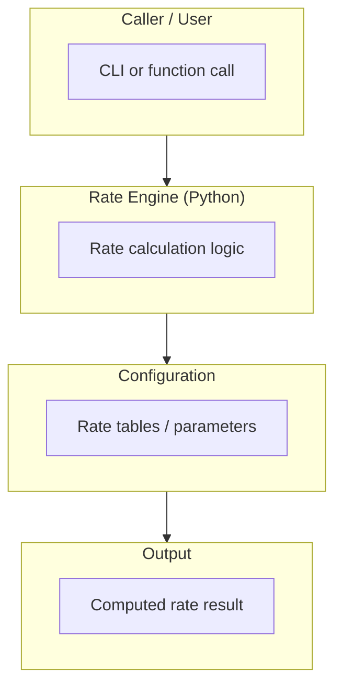
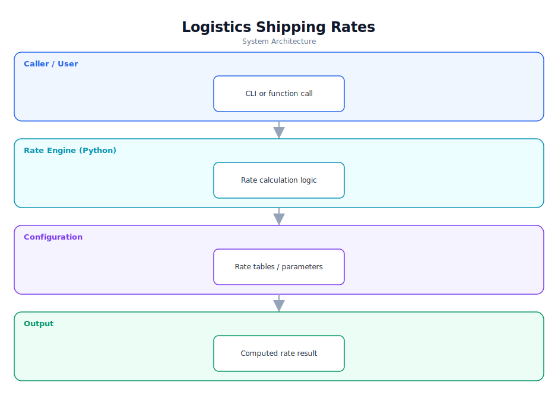

# Logistics Shipping Rates — Software Documentation

> A Python module for computing logistics shipping rates.

**Repository:** [`LogisticsShippingRates`](https://github.com/Monametsi-s/LogisticsShippingRates)  
**Type:** Python module / utility  
**Status:** Minimal / unclear scope

---

## 1. Overview

Logistics Shipping Rates is a small Python project intended to compute shipping rates for logistics scenarios. The repository currently ships with a generic contributing guide rather than a feature description, so this document outlines a sensible target architecture for a rate-calculation utility.

## 2. System Architecture

The diagram below shows the high-level architecture and how data flows between layers. It renders automatically on GitHub (Mermaid) and is also committed as a vector image ([`architecture.svg`](architecture.svg)).



<p align="center"></p>

### 2.1 Component responsibilities

| Layer | Responsibility |
|---|---|
| **Caller / user** | Invokes the calculator (CLI input or function arguments). |
| **Rate engine** | Core Python logic that computes a shipping rate. |
| **Configuration** | Rate tables, zones, and parameters. |
| **Output** | Returns or prints the computed rate. |

## 3. Technology Stack

| Area | Technology |
|---|---|
| Language | Python |

## 4. Assumed User Requirements

_These requirements are inferred from the project's purpose and feature set; they document the intended behaviour rather than a formally agreed specification._

### 4.1 Functional requirements

- **FR-01** — Accept shipment parameters (e.g. weight, distance/zone).
- **FR-02** — Apply rate tables/rules to compute a shipping cost.
- **FR-03** — Return or print the computed rate.
- **FR-04** — Be importable as a module or runnable as a script.

### 4.2 Representative user stories

- As a developer, I want a function that returns a shipping rate for given inputs.
- As a user, I want to compute a rate from the command line.
- As a maintainer, I want the rate rules to be configurable.

### 4.3 Non-functional requirements

- Calculations must be deterministic and testable.
- Inputs should be validated.
- The module should be easy to import and reuse.

## 5. Assumed System Requirements

### 5.1 End-user (runtime) requirements

- Python 3.8+ runtime to execute the module or script.

### 5.2 Server / hosting requirements

- None — this project runs entirely on the client; no application server is required.

### 5.3 External services & API keys

- None — the application has no third-party service dependencies at runtime.

### 5.4 Developer / build requirements

- Python 3.8+ and pip.
- (Recommended) a virtual environment and a test framework such as pytest.

## 6. Data Model

Rate tables/parameters (zones, weight brackets, multipliers) drive the calculation; structure depends on the implementation.

## 7. Setup & Installation

```bash
git clone https://github.com/Monametsi-s/LogisticsShippingRates.git
cd LogisticsShippingRates
python -m venv venv && source venv/bin/activate
# run or import the module
python main.py
```

## 8. Assumptions & Future Considerations

- Add a real README describing inputs, outputs, and rate rules.
- Add unit tests for the calculation logic.
- Expose a clean function/CLI interface.

---

<sub>This document was generated as part of a portfolio-wide documentation pass. User and system requirements are **assumed** from the codebase, README, and project intent, and should be validated against real product goals before being treated as authoritative.</sub>
